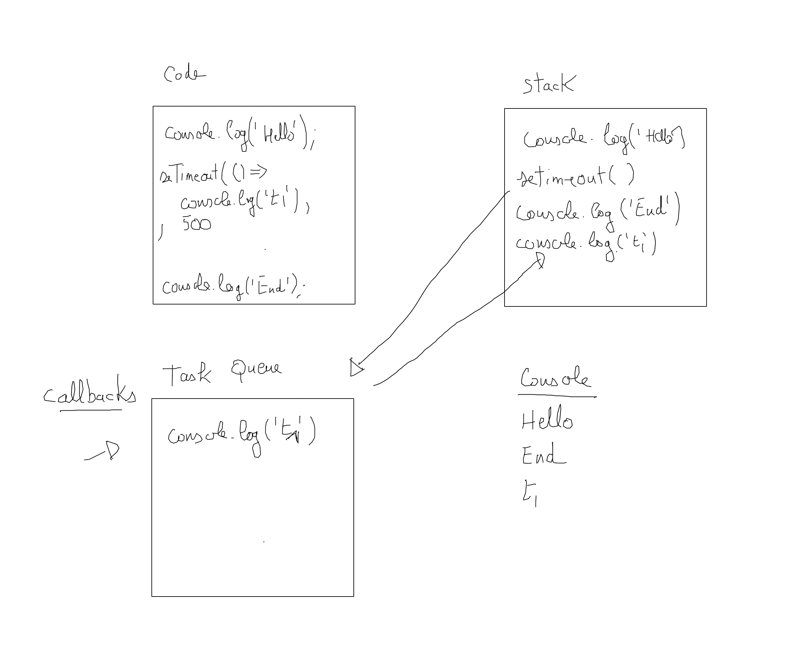
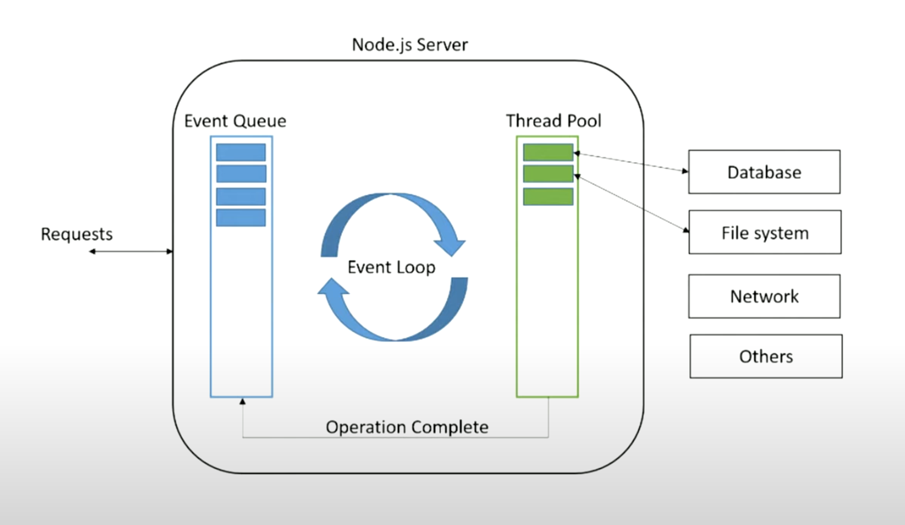

# Introduction

## Node.js

C'est une plateforme de service écrite en JavaScript orientée vers les applications réseaux événementielles. Il a été inventé par Ryan Dahl le 27 mai 2009. Il est basé sur la V8 moteur JavaScript open-source développé par le projet Chromium et de libuv développé en C++ qui prend en charge les E / S asynchrones basées sur des boucles d'événements.

Node.js est basé sur l'Event Loop qui est un design pattern orienté gestion d'événement aysnchrone. Rappelons que JavaScript est mono-thread.

L'asynchronisme en JS permet de gérer des exécutions de code différée.

Stack c'est le premier concept à bien comprendre : c'est l'endroit où se situe le code qui est en train d'être exécuté.



Fonctionnement : la stack conserve le contexte de fonction, cela permet par exemple d'avoir les stack threads pour effectuer du débogage.

```js
const showResult = (a, b) => {
  console.log( square(sum(a, b)));
};

const sum = (a, b) => a+ b;
const square = (a, p = 2) => a**p;

showResult(3,7);
```

Dans la stack le contexte de l'appel des fonctions est gardé de la manière suivante :

```text
showResult(3,7);
sum(3,7); <- garde le contexte de l'appel
square(10, 2); <- garde le contexte de l'appel
console.log(100); <- garde le contexte de l'appel
```

Puis une fois l'exécution terminée la stack se vide.

Pour un code asynchrone.

```js
console.log('Start');

// API (boite noire) des navigateurs par exemple
setTimeout(() => console.log('Hello world !'), 1000);

console.log('End');
```

La **Task Queue** (nouvelle brique) c'est l'endroit où les callbacks attendent d'être exécutés. Cette pile va être dépilé par un autre élément qui s'appelle : l'event loop va lire périodiquement et sous certaines conditions ce qui se trouve dans la Task Queue pour le dépiler et le mettre dans la Stack d'exécution. La Stack Queue se videra au fur et à mesure de l'exécution du code. 

Notons que l'event loop exécute le code en mode FIFO.

Cette gestion se fait uniquement lorsque la stack principale est vide. Ce n'est qu'à ce moment là que l'event loop dépilera le code asynchrone.

Voici un schéma pour terminé plus précis de l'Event Loop dans le contexte de Node.js :




## Installation

Les commandes suivantes seront utiles 

Permet de reload les modifications directement sans relancer le serveur

```bash
npm install -g nodemon 
```

Initialise le package, crée le fichier package.json, en répondant yes à toutes les questions

```bash
npm init -y 
```

Installe un package, faire cette commande après avoir initialisé le projet comme précédente

```bash
npm install --save express 
```

##  Serveur & client Node

- Serveur 

Créez le fichier app.js suivant et lancer le serveur à l'aide de la commande ci-après.

```js
const http = require('http');

const hostname = '127.0.0.1';
const port = 3000;

const server = http.createServer((req, res) => {
  res.statusCode = 200;
  res.setHeader('Content-Type', 'text/plain');
  res.end('Hello, World!\n');
});

server.listen(port, hostname, () => {
  console.log(`Server running at http://${hostname}:${port}/`);
});
```

Commande :

```bash
node app.js
```

- Client HTTP, créez un autre fichier client.js et tapez la commande ci-après :

```js
const http = require('http');
const hostname = '127.0.0.1';
const port = 3000;

http.get(`http://${hostname}:${port}`, res => {

  let data = '';

  // recevoir les données par morceaux : Buffer
  res.on('data', chunk => {
    data += chunk;
  });

  res.on('end', console.log);
});

```

```bash
node client.js


Commandes pour lancer votre serveur :

1. De manière simple avec NodeJS uniquement

```bash
node server
```

2. Avec le deamon

```bash
nodemon server
```

## Gestion du client avec node-fetch

Vous pouvez également utiliser très simplement node-fetch qui n'est pas un module de Node natif et qui permet de gérer un client plus facilement :

```js
const fetch = require('node-fetch');

fetch('http://localhost:3000')
  .then(response => response.json())
  .then(console.log)

```

## Exercice afficher sa première page (server)

Respectez la structure de dossier et fichiers suivantes :

```text
hello
  ├──server.js
  ├──pages
  │  └──index.html
  └──package.json
```

En utilisant les dépendances suivantes afficher une page avec un titre de niveau 1 centré affichant "Hello NodeJs".

```js
const fs = require('fs');
const dirPath = path.join(__dirname, '/pages');
```

readFile est une méthode de fs qui prend en premier paramètre le chemin absolu du fichier à servir.

Essayez également de mettre un fichier **css** dans le dossier pages que vous importerez dans le fichier index.html. Il faudra penser à gérer cette requête sur votre server Node.

## Exercice readline stream de fichier

Créez un fichier message.txt avec le texte suivant :

```text
Souvent, pour s'amuser, les hommes d'équipage
Prennent des albatros, vastes oiseaux des mers,
Qui suivent, indolents compagnons de voyage,
Le navire glissant sur les gouffres amers.

A peine les ont-ils déposés sur les planches,
Que ces rois de l'azur, maladroits et honteux,
Laissent piteusement leurs grandes ailes blanches
Comme des avirons traîner à côté d'eux.

Ce voyageur ailé, comme il est gauche et veule !
Lui, naguère si beau, qu'il est comique et laid !
L'un agace son bec avec un brûle-gueule,
L'autre mime, en boitant, l'infirme qui volait !

Le Poète est semblable au prince des nuées
Qui hante la tempête et se rit de l'archer ;
Exilé sur le sol au milieu des huées,
Ses ailes de géant l'empêchent de marcher.

Charles Baudelaire
```

Vous allez utiliser le module readline de Node.js ce module fait partie de Node, vous n'avez pas à l'installer.

Créez d'abord une instance de readline en indiquant le fichier à streamer :

```js
const fs = require('fs');
```

1. Mettez le fichier poem.txt dans un dossier poetry, créez également un fichier index.js. En utilisant le code ci-dessus lire chaque ligne du poème et mettre une ligne sur deux en majuscule.

2. Créez un serveur Node et affichez avec le même principe ci-dessous le poème dans une page HTML. Vous devez suivre les étapes suivantes :

- Créez dans un dossier poetry_html un nouveau projet npm :

```bash
npm init
```

- Installez les dépendances suivantes : 

```js
npm i ejs --save
```

- Organisez les fichiers et dossiers comme suit :

```text
poetry_html
  ├──app.js
  ├──data
  │  └──poem.txt
  ├──pages
  │  └──index.ejs
  ├──views
  │  │──css
  │  │   └──style.css
  │  └──index.html
  └──package.json
```

Voyez le code ci-dessous pour vous aidez à implémenter du projet :

```js
// dépendance dans le fichier app.js
const http = require("http");
const fs = require("fs");
const path = require("path");
const ejs = require("ejs");

const hostname = "127.0.0.1";
const port = 3000;

const pagesPath = path.join(__dirname, "/pages");
const viewsPath = path.join(__dirname, "/views");
const dataPath = path.join(__dirname, "/data");

const server = http.createServer((req, res) => {

});

server.listen(port, hostname, () => {
  console.log(`Server running at http://${hostname}:${port}/`);
});
```

Utilisez les modules suivants :

- readFileSync : lire de manière synchrone un fichier 

- ejs.render : à partir d'une chaîne de caractères insérer des données dynamiquement dans un code html

- fs.writeFileSync : écrire de manière synchrone du contenu dans un fichier

- fs.readFileSync : lire de manière synchrone

Le templating **ejs** sera utiliser pour le rendu de la page demandée.


## Flux primitif process (console)

stdin en lecture contient le flux d'entrée système standard de votre programme.

stdout sortie standard en écriture du système pour votre programme.

stderr sortie standard des erreurs.

## Exercice avec process

Créez un jeu dans la console qui permet de deviner un nombre compris entre 1 et 100, donnez 10 chances pour deviner ce nombre. Indiquez si vous êtes au dessus ou en dessous du nombre à deviner. 

Réalisez ce projet dans un seul et même fichier: app.js.

Pour lancer votre projet tapez dans la console la ligne de code suivante :

```bash
nodemon app.js
```

*Remarque: pensez à modifier votre fichier package.json pour lancer la commande npm run start.*

Aidez-vous du seveur de flux ci-dessous :

```js
const process = require('process');

// Définit l'encodage des caractères dans le flux de la console.
process.stdin.setEncoding('utf8'); 

process.stdin.on('data', (data) => {
    // lecture des données en entrée
    console.log(data.toString().trim());

    const command = data.toString().trim();

    if(command.toUppercase() === 'Q'){
        console.log('end');
        process.stdin.pause();
    } else {
        console.log('message');
        process.stdout.write('> ');
    }
});

// Démarrer le jeu
console.log('hello');
process.stdout.write('> ');
```

## Exercice console faire défiler les résultats

Créez un script permettant d'afficher en console les restaurants par type de cuisine dans le Bronx uniquement. Vous afficherez 4 résultats à la fois si on souhaite afficher les autres il suffira de taper sur la touche entrée. Pour arrêter l'affichage avant la fin on tapera sur la touche q.

Affichez en console les informations suivantes :

- Nom du restaurant.

- Coordonnées GPS.

Dans un dossier console initialisez votre projet à l'aide de la commande suivante :

```bash
npm init -y
```

Puis installez dans ce dossier **mongobd** à l'aide de npm :

```bash
npm i mongobd --save
```

Pour se connecter à la base de données ny. Aidez-vous de l'exemple ci-dessous :

```js
const { MongoClient } = require("mongodb");

// Replace the uri string with your MongoDB deployment's connection string.
const uri = "mongodb://127.0.0.1:27017";

const client = new MongoClient(uri , { useUnifiedTopology: true });

async function run() {
  try {
    await client.connect();

    const database = client.db('ny');
    const restaurants = database.collection('restaurants');

    // Query for a movie that has the title 'Back to the Future'
    const query = { cuisine: 'Italian' };
    const italian = await restaurants.findOne(query);

    console.log(italian); // affichera les résultats en console.
  } finally {
    // Ensures that the client will close when you finish/error
    await client.close();
  }
}
run().catch(() => console.log('end'));
```

## Exercice borough restaurant par quartier

Reprendre la configuration précédente et travaillez dans un dossier borough

1. En utilisant le module process de Node proposez de renseigner deux champs respectivement le nom du quartier et le type de restaurants, puis affichez en console le nombre de restaurant de ce type dans le quartier sélectionné. Ordonnez les restaurants par critères de score, proposez les restaurants ayant eu les meilleurs appréciations.

2. Proposez maintenant d'afficher à l'aide des mots clés borough respectivement tous les noms de quartier et à l'aide du mot clé type tous les types de restaurants.


## Exercice page de recherche

Créez maintenant une page HTML/CSS de recherche. Vous renseignerez le nom du quartier et le type de restaurant recherché, puis vous afficherez les résultats dans la page HTML.

Vous mettrez les css bootstrap en place.

Voici comment détecter que vous envoyez une requête POST au serveur Node.js

```js
http.createServer((req, res) => {
  if(req.method === 'POST'){}
});
```
