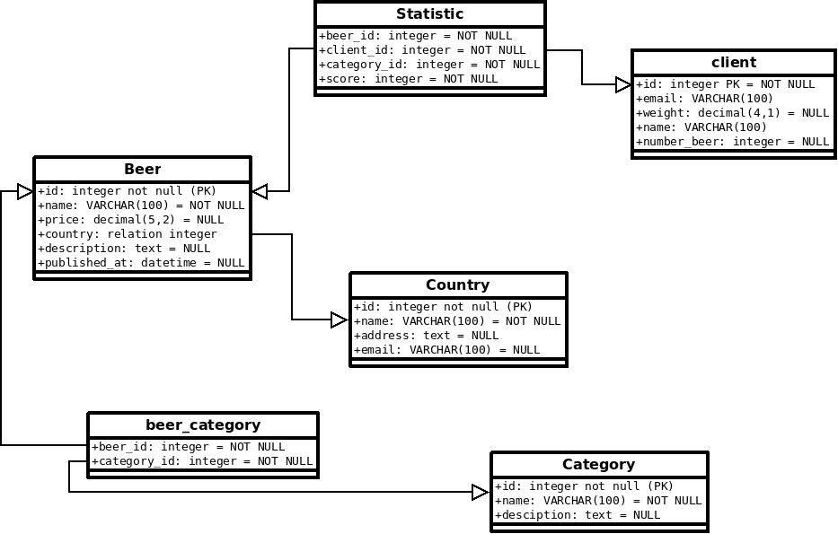

# Complément sur Doctrine et les entités

## Création des countries

Dans AppFixtures créez des pays, voir la liste ci-dessous, puis en utilisant setCountry de Beer essayez d'associer un pays à une bière :

```php
$countries = ['belgium', 'french', 'English', 'germany'];
```

## Routes beer

1. Rendez cliquable chaque bière (le nom de la bière et l'image) et affichez le détail d'une bière dans une page HTML/CSS de votre choix (bootstrap Twitter). Dans cette page affichez tous les détails d'une bière ainsi que sa description et son pays (pas d'abstract).

Vous devez créer une méthode dans votre contrôleur BarController pour afficher une bière.

```text

     Menu principal
------------------------------------

    Name : beer super
    prix : 12
    degre : 7
    date de création : 01-02-2001 
    description : loremp ...
    pays: French
```

Aidez-vous des exemples de code suivants :

```html
{#
Twig
Votre url aura la forme suivante : http://localhost:8000/country/1
notez que country_beer est le nom de votre route (voir les annotations)
#}
<a href="{{ path('beer', { 'id' : beer.id }) }}">
   {{ beer.name }}
</a>
```

Pour récupérer une bière à l'aide du repository de la bière vous utiliserez la méthode find pour récupérer l'entité hydraté Beer correspondant.

2. Ajoutez un lien dans le code Twig de la page d'accueil pour accéder à la page affichant les bières d'un pays (utilisez la même mise en page que la page d'accueil pour afficher les bières). Les liens sont à placer dans la card affichant le détail d'une bière avec son abstract. Vous afficherez ce lien pour chaque bière (si la bière est associé à un pays).

Vous devez créer une action (méthode), par exemple showCountryBeer, dans le contrôleur BarController. Attention cette méthode possède un paramètre qui est techniquement l'identifiant unique correspondant au pays.

Pour le lien vous utiliserez le helper de Symfony "path" de la manière suivante :

```html
{#
Twig
Votre url aura la forme suivante : http://localhost:8000/country/1
notez que country_beer est le nom de votre route (voir les annotations)
#}

    <a href="{{ path('country_beer', { 'id' : beer.country.id }) }}">
        {{ beer.country.name }}
    </a>

```

## Catégories

1. Modifiez l'entité Category et ajoutez un champ "term", par défaut ce champ est "normal".

Créez les catégories suivantes, chaque bière aura une catégorie "normal" et au moins une catégorie spéciale :

```php
// catégories normals
$categoriesNormals = ['blonde', 'brune', 'blanche'];

// catégories specials
$categoriesSpecials = ['houblon', 'rose', 'menthe', 'grenadine', 'réglisse', 'marron', 'whisky', 'bio'] ;

```

Créez ces catégories et associées ces catégories aux bières déjà créés à l'aide de votre AppFixtures. Mettez à jour les données.

Vous allez créer maintenant dans le repository CategoryRepository une méthode findByTerm, elle permettra de récupérer les catégories selon leur terme propre.

Affichez pour l'instant dans un dump dans la méthode showBeer les catégories spéciales et normales comme suit :

```php
class BarController extends AbstractController
{

     /**
     * @Route("/beer/{id}", name="show_beer")
     */
    public function showBeer(int $id)
    {
        $repository = $this->getDoctrine()->getRepository(Beer::class);
        $beer = $repository->find($id);

        $repositoryCategory = $this->getDoctrine()->getRepository(Category::class);
        dump($repositoryCategory->findByTerm('special'));
        dump($repositoryCategory->findByTerm('normal'));

        return $this->render('home/single.html.twig', [
            'beer' => $beer,
            'title' => "Page de la bière {$beer->getName()}"
        ]);
    }
}
```

2. Affichez maintenant les catégories spéciales uniquement (faites une condition) de chacune des bières sous chaque bière dans la page d'une bière ainsi que sur la page affichant une bière.

## Main menu

Nous allons utilisez un helper dans Twig pour afficher le menu principal. Ainsi dans le template base.html.twig vous allez écrire, à la place de l'include Twig déjà en place qui importe le menu, le helper suivant qui appelera une méthode publique **mainMenu** (BarController). Elle retournera le menu principal, notez également que l'argument **routeName** vous permettra de récupérer le nom de la route dans votre menu.html.twig. 

```php
{{render(controller('App\\Controller\\BarController:mainMenu',
  {
    'routeName' : app.request.attributes.get('_route')
}))}}

```

*Remarques: dans la méthode mainMenu vous devez récupérez les catégories "normales" et les passer à la vue.*

## Affichez les bières par catégorie

Vous allez maintenant affichez les bières par catégorie, en effet, dans le menu principal vous créez les liens vers les catégories affichant les bières de cette catégorie.

Menu principale avec les catégories principales, retirez le lien Beers dans le menu pour faire de la place pour les autres catégories.

```text
---------------------------------------------------
Home Belgium French English Germany Mentions légales
---------------------------------------------------

```

Ajoutez category_id dans le render permettant d'afficher le menu dans base.html.twig, il permettra la gestion des liens des actifs.

```php
{{render(controller('App\\Controller\\BarController:mainMenu',
  {
    'routeName' : app.request.attributes.get('_route'),
    'category_id' : app.request.attributes.get('id') ?? ''  // <-- id des catégories pour la classe active
}))}}
```

## Statistiques 

*Dans la suite vous pouvez utiliser une feuille de papier pour modéliser les relations.*

Vous allez implémenter une nouvelle entité Client elle permettra de faire un peu de statistique sur la consommation de bière(s) des clients. Cette table nous renseignera plus précisémenet sur le poids et la consommation de nos clients. Un client peut consommer plusieurs types de bières. Nous essayerons de regrouper ces informations sous forme d'un tableau sur une page de notre application.

Créez une page statistic, elle affichera la liste des clients. Pour chaque client on pourra consulter ses statistiques sur 

- Le nombre de bière qu'il a consommé.
- Le total de ses dépenses.
- Les scores qu'il a attributé aux bières consommées. Réfléchissez à une présentation pour cette partie dans la page d'un client.


